<div align="center">

# 🎯 ProView AI Interviewer

**你的私人 AI 面试教练 — 模拟真实面试 · 智能评估报告 · 精准简历优化**

[](LICENSE)
[](backend/requirements.txt)
[](frontend/package.json)
[](frontend/package.json)
[](desktop/package.json)
[](https://github.com/gravel-01/proview-desktop/releases/tag/v0.1.0-alpha.1)

<br>

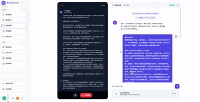

<br>

<em>每投出一份简历，都应该是深思熟虑后的自信出击 💪</em>

</div>

---

## 💛 先说个真事儿

> 面试前夜，你是否也曾这样？
>
> 对着镜子反复练习，却不知道回答得好不好
> 投出去的简历石沉大海，不知道哪里出了问题
> 每次面试完感觉还行，结果却总是不如意
>
> **我们懂这种感觉。** 所以做了 ProView —— 一个让你在家就能练面试、看报告、优化简历、规划职业方向的本地工具。
>
> 不卖课、不订阅、数据不走云 —— 就是个工具，用完你实力见长。

---

## 🔄 三步走：从"试试看"到"胸有成竹"

ProView 不是孤立的工具，而是一个**数据闭环**。每一次面试练习都在积累你的能力画像，让简历优化更有依据，让职业规划不再空洞。

### 🚶 第一步：面试模拟 — 先动起来

> _"看完简历，AI 直接开始提问，像真面试官一样追问"_

上传简历，选择目标岗位和面试场景，让 AI 发起一场**真实的语音模拟面试**。

| 你能体验到 | 说明 |
|-----------|------|
| 🎯 简历驱动提问 | AI 读懂你的简历后，有针对性地出题 |
| 🎤 语音实时交互 | 像真人面试一样开口说，语音自动转文字 |
| ⚡ 即时反馈 | 回答过程中，AI 实时指出表达问题 |
| 📊 一键生成报告 | 面试结束，秒出评估报告，立竿见影知道薄弱点 |

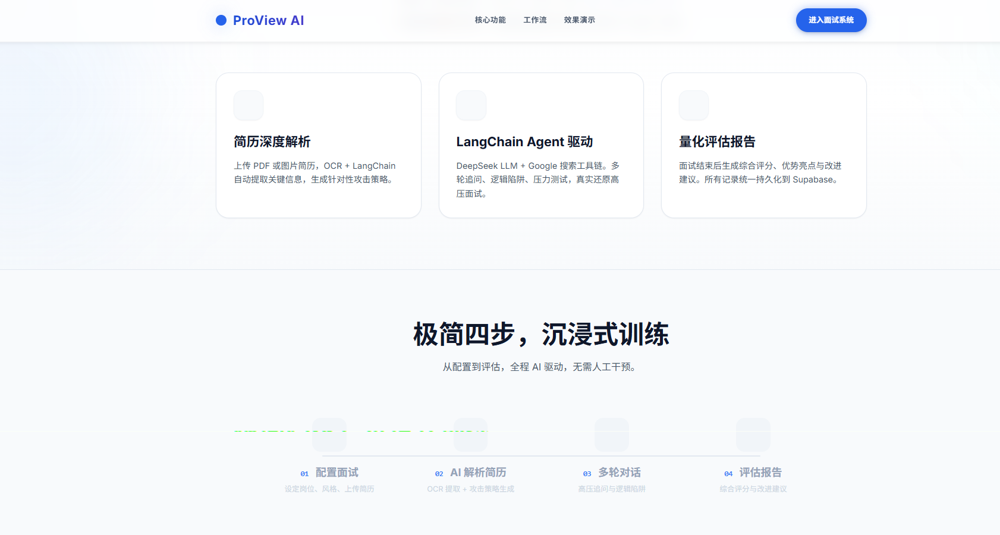
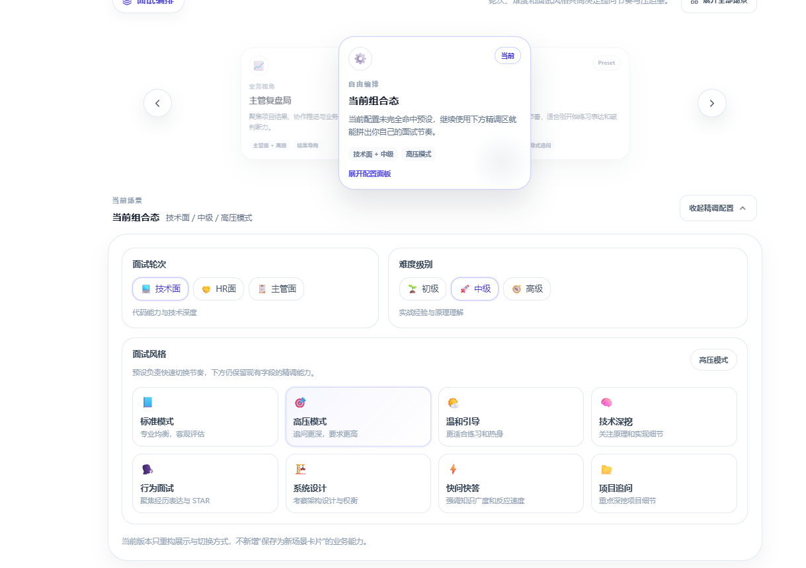
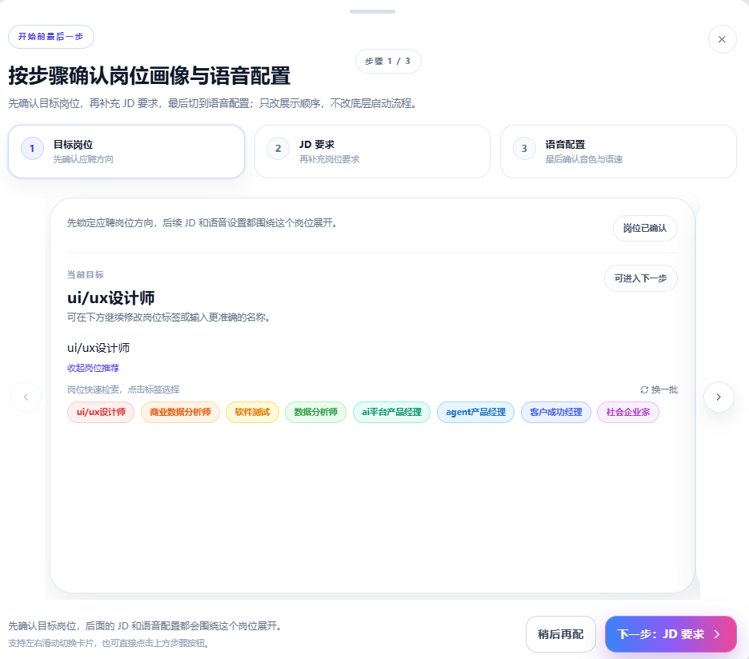
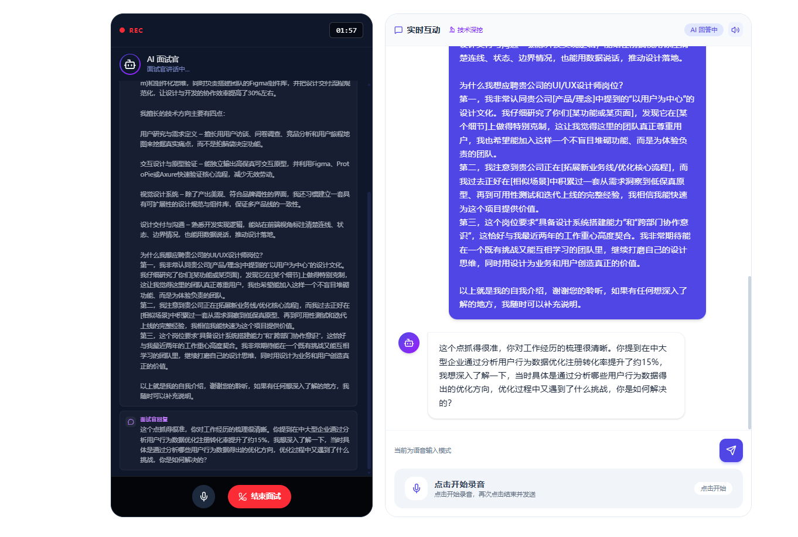
---

### 📄 第二步：简历优化 — 趁热打铁

> _"报告指出'项目经验描述不够清晰'，直接点击'去优化简历'，AI 帮你改"_

面试报告不是终点，而是优化的起点。针对报告里暴露的简历短板，直接在 ProView 里做定向优化。

| 你能体验到 | 说明 |
|-----------|------|
| 🔍 问题定位 | 从面试反馈中提炼出简历需要回答的核心问题 |
| ✏️ AI 辅助改写 | 保留真实经历，放大亮点，说清楚价值 |
| 📁 集中管理 | 已上传简历统一管理，随时切换不同版本 |

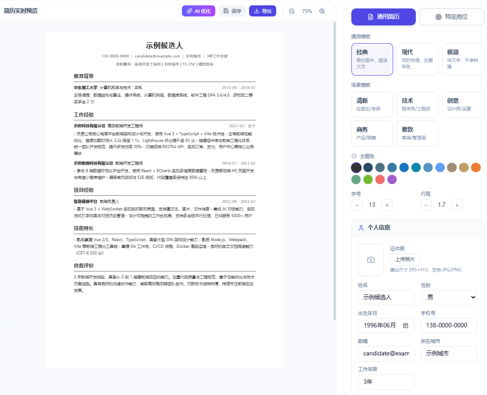
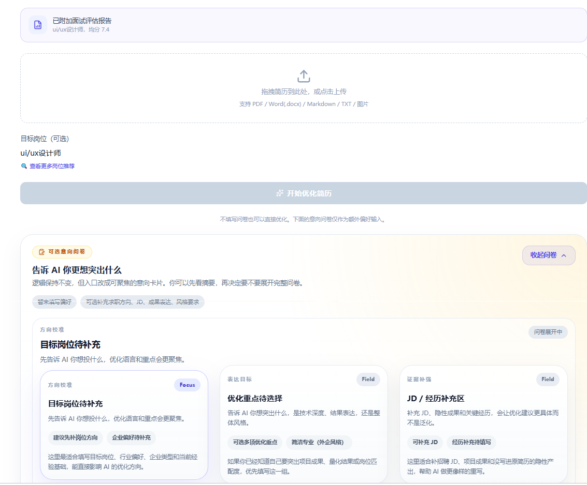

---

### 🗺️ 第三步：职业规划 — 做时间的朋友

> _"练了 5 次面试，AI 发现你每次都在'系统设计'上卡壳，推荐这个方向深耕"_

当你在 ProView 上积累了一定的面试数据，AI 会基于你的实际表现，画出更真实的成长路线图。

| 你能体验到 | 说明 |
|-----------|------|
| 📈 数据沉淀 | 多次面试形成能力雷达图，看见真实的自己 |
| 🗺️ 学习路线图 | 根据薄弱点生成专项提升路径和任务清单 |
| 📖 知识库 | 面试复盘和职业规划文档统一沉淀，不丢失 |

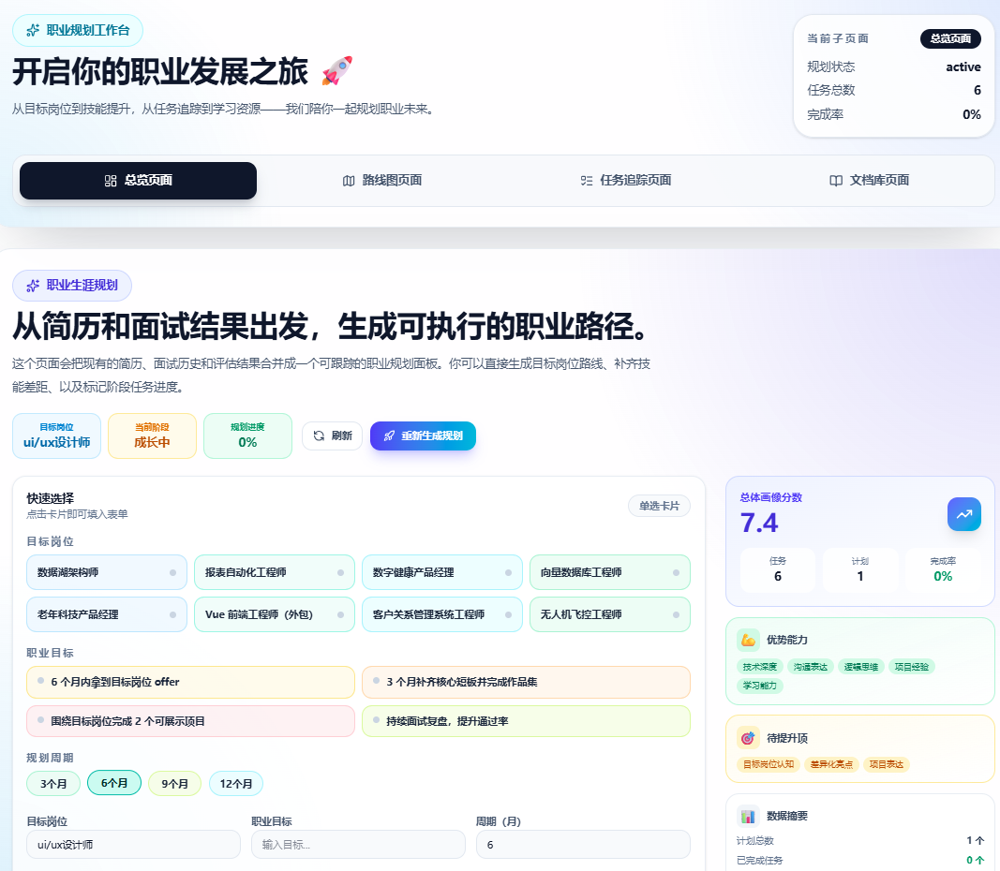

---

### 🔗 数据闭环，构建产品壁垒

```
┌─────────────────────────────────────────────────────────────┐
│                                                             │
│   📋 简历上传  ──→  🎙️ 模拟面试  ──→  📊 评估报告          │
│        ↑                                    ↓               │
│        │                              💡 发现短板            │
│        │                                    ↓               │
│        │                           ✏️  简历定向优化          │
│        │                                    ↓               │
│        │                          📈 能力数据积累           │
│        │                                    ↓               │
│        └──────  🗺️ 职业规划建议  ◄────────────────┘        │
│                                                             │
└─────────────────────────────────────────────────────────────┘
```

> **为什么 ProView 越用越懂你？** 因为每一步都在构建你的个人能力画像。面试数据 → 简历优化 → 职业规划，三者互通互联，数据越丰富，AI 给的建议越精准。

---

## ✨ 更多能力

| 模块 | 功能亮点 |
|------|---------|
| 🎨 **简历生成工作台** | 内置多套模板，AI 辅助编辑，一键导出 PDF |
| 📁 **多格式简历上传** | PDF / Word / 图片，OCR 自动解析结构化 |
| 🔊 **多音色面试官** | 支持不同音色和面试风格切换 |
| 🏠 **完全本地运行** | 数据不联网，API 密钥由你自己保管 |
| 🖥️ **桌面 & Web 双模式** | Web 开发联调，或直接打包成 Windows 应用 |

---

## 🖼️ 界面预览

<table>
<tr>

<td></td>
<td></td>
</tr>
<tr>
<td>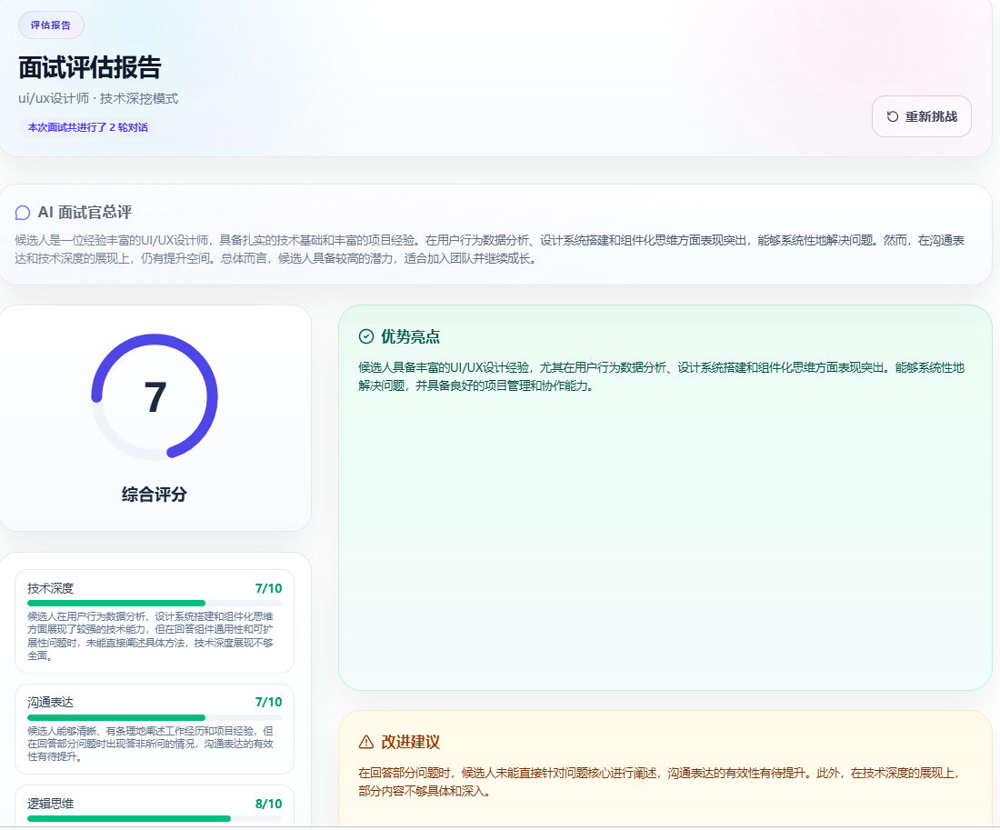</td>
<td></td>
</tr>
</table>


---

## 🚀 快速开始

### 📦 下载桌面版（3 分钟上手）

1. 前往 [GitHub Release](https://github.com/gravel-01/proview-desktop/releases/tag/v0.1.0-alpha.1) 下载安装包
2. 双击安装，首次启动后在 **应用设置** 中填入你的 API 密钥
3. 开始练习

> 💡 百度文心、PaddleOCR、语音服务均有每日免费额度，零成本体验全部功能

### 🔧 开发者模式（Web / 桌面调试）

<details>
<summary><b>点我展开完整步骤</b></summary>

#### 1. 安装依赖

```powershell
# 后端
cd backend
python -m pip install -r requirements.txt

# 前端
cd ../frontend
npm install

# 桌面壳（可选）
cd ../desktop
npm install
```

#### 2. 配置环境变量

```powershell
cd backend
Copy-Item .env.example .env
```

最小可用配置：

```env
DEEPSEEK_API_KEY=
DEEPSEEK_BASE_URL=https://api.deepseek.com/v1

ERNIE_API_KEY=
ERNIE_BASE_URL=https://aistudio.baidu.com/llm/lmapi/v3
```

#### 3. 启动项目

```powershell
# 终端 1 - 后端
cd backend
python app.py

# 终端 2 - 前端
cd frontend
npm run dev
```

访问 `http://localhost:5173/app.html` 即可使用。

#### 桌面版调试

```powershell
cd desktop
npm run build:frontend
npx electron .
```

#### Windows 打包

```powershell
.\package-desktop.ps1
```

</details>

---

## 🔑 API 配置指南

<details>
<summary><b>常用配置速查</b></summary>

| 配置项 | 用途 | 免费额度 |
|--------|------|---------|
| `ERNIE_API_KEY` | 百度文心一言 | ✅ 每日免费 |
| `PADDLEOCR_API_URL` | 简历 OCR 解析 | ✅ 每日免费 |
| `BAIDU_APP_KEY` | 百度语音识别/合成 | ✅ 每日免费 |
| `DEEPSEEK_API_KEY` | DeepSeek 大模型 | 需付费 |

</details>

<details>
<summary><b>密钥获取教程（图文）</b></summary>

登录 [百度星河社区](https://aistudio.baidu.com/overview) → 完成实名认证 → 获取文心 API Key → 复制到应用设置即可。

参考截图引导：

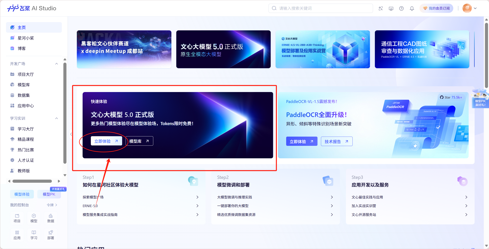
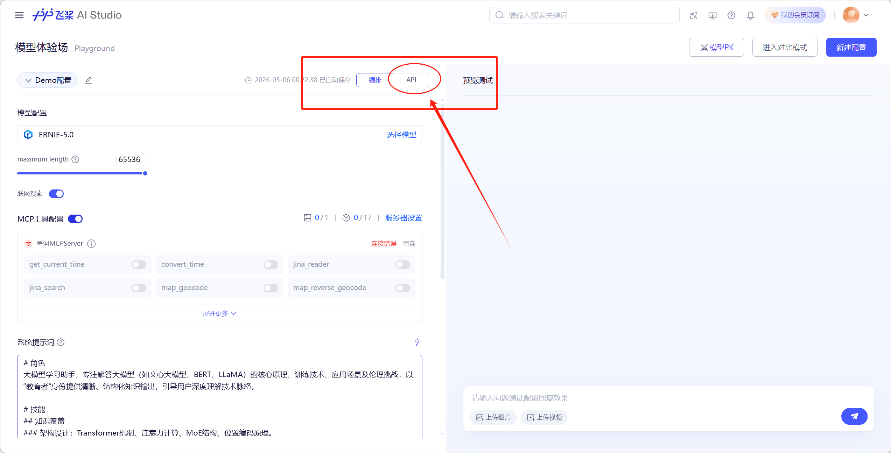


</details>

---

## 🏗️ 技术架构

```
浏览器 / Electron (Vue 3 + TypeScript)
         ↓
   Flask 后端 (LangChain + SSE)
         ↓
LLM (DeepSeek / 文心) · OCR (PaddleOCR) · 语音 (百度)
         ↓
 PostgreSQL / SQLite (本地存储，数据不外传)
```

| 层级 | 技术 |
|------|------|
| 前端 | Vue 3 + TypeScript + Vite + Tailwind CSS |
| 后端 | Flask + LangChain + SSE + Playwright |
| 桌面壳 | Electron + electron-builder |
| 存储 | PostgreSQL / SQLite 本地优先 |
| AI | DeepSeek / 文心一言 |

---

## 📁 项目结构

```
proview-desktop/
├── frontend/          # Vue 3 前端 (落地页 + 业务应用)
├── backend/           # Flask API (面试 / 简历 / OCR / 报告)
├── desktop/           # Electron 桌面壳
├── database/          # 本地数据库
├── img/               # 截图素材
└── README.md
```

---

## 📚 更多文档

| 文档 | 适合谁 |
|------|--------|
| [README_WEB.md](README_WEB.md) | 前后端联调开发者 |
| [README_DESKTOP.md](README_DESKTOP.md) | Electron 调试 / 打包 |
| [CONTRIBUTING.md](CONTRIBUTING.md) | 协作者 |
| [SECURITY.md](SECURITY.md) | 安全漏洞报告 |

---

## 💬 常见问题

<details>
<summary><b>不填 API 密钥能用吗？</b></summary>

可以启动，但 AI 面试、OCR、语音功能不可用。建议至少配置一个模型密钥体验核心流程。
</details>

<details>
<summary><b>数据会上传到云端吗？</b></summary>

不会。所有数据存在本地，模型调用走你自己的 API 密钥，不经过任何第三方服务器。
</details>

<details>
<summary><b>职业规划模块完善了吗？</b></summary>

核心能力已可用，部分功能（如多轮面试雷达图）仍在迭代中，欢迎体验并提出建议。
</details>

---

## 📜 许可

本仓库采用**非商业参考许可**，你可以自由学习、研究和非商业使用，但禁止商用、禁止低改动复用、禁止用于比赛/评审/黑客松等活动。

完整许可文本：[LICENSE](LICENSE) · [中文说明](REPOSITORY_USAGE_TERMS.zh-CN.md)

---

<div align="center">

<br>

**祝你每一次面试，都是有准备的绽放 🌸**

<br>

如果你觉得 ProView 有帮助，欢迎给我们一个 ⭐

<br>

<sub>Made with ❤️ for every job seeker</sub>

</div>
