# 写在前面

单机桌面测试版已经发布，可直接下载体验：

- [GitHub Release v0.1.0-alpha.1](https://github.com/gravel-01/proview-desktop/releases/tag/v0.1.0-alpha.1)

首次使用时，请先在应用内填写你自己的模型、OCR 和语音服务密钥。

# ProView AI Interviewer / ProView Desktop

ProView 是一个本地优先的 AI 求职训练工作台。项目包含同一套业务前端、同一套 Python 后端，以及将两者封装为桌面应用的 Electron 壳层。

它不只是一个“AI 模拟面试”演示项目，而是一套完整的本地求职工作流工具，覆盖面试训练、简历处理、简历优化、简历生成和职业规划等能力。

## 界面预览

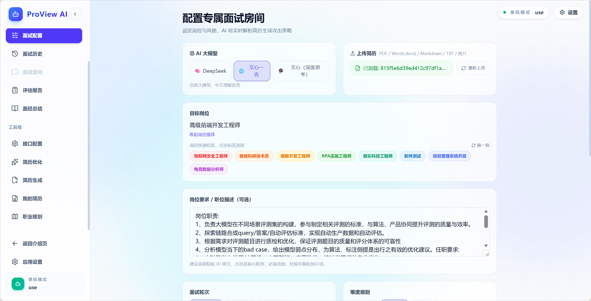

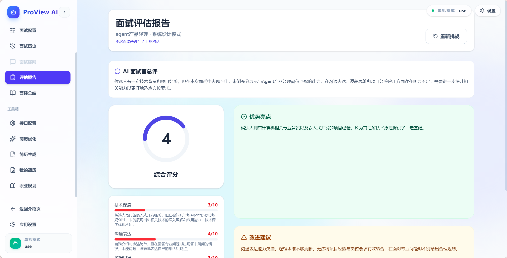

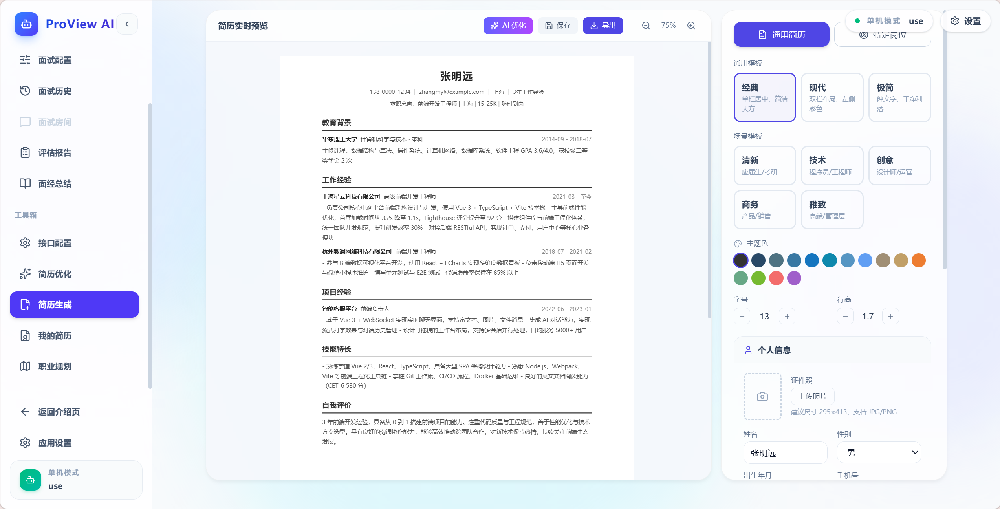

## 核心能力

- 面试配置、实时面试、总结报告、历史记录
- 简历上传、解析与本地管理
- 简历优化问卷与优化建议生成
- 简历生成器与导出
- 职业规划工作台
- Web 与桌面版共用同一套业务前后端

## 仓库结构

- `frontend/`：Vue 3 + Vite 前端。`index.html` 是落地页，`app.html` 是业务应用入口。
- `backend/`：Flask API，负责面试流程、简历处理、OCR、PDF 导出、历史记录、职业规划和运行时配置。
- `desktop/`：Electron 桌面壳，负责启动本地后端、加载前端构建产物，并打包 Windows 桌面版。
- `database/`：本地数据库目录。
- `doc/`：开发说明与流程文档。

## 按需阅读

如果你是按目标进入项目，建议直接看对应文档：

- [README_WEB.md](README_WEB.md)：适合 Web 版开发、前后端联调。
- [README_DESKTOP.md](README_DESKTOP.md)：适合桌面版调试、运行时和打包。

如果你准备公开仓库或协作开发，建议同时阅读：

- [CONTRIBUTING.md](CONTRIBUTING.md)：贡献方式、提交流程、验证要求。
- [SECURITY.md](SECURITY.md)：漏洞报告方式、敏感信息处理和开源前安全检查。
- [backend/.env.example](backend/.env.example)：配置示例，避免提交真实密钥。

## Web 与桌面版的关系

两者不是两套独立系统，而是同一套业务前后端代码的两种运行方式。

```text
Web 版
浏览器 -> frontend(Vite / dist) -> backend(Flask)

桌面版
Electron -> 启动本地 backend(Flask) -> 加载 frontend/dist/app.html
```

关键区别如下：

- Web 开发模式下，需要手动分别启动 `backend` 和 `frontend`。
- 桌面版运行时，由 Electron 自动启动本地 `backend`，再加载 `frontend/dist/app.html`。
- 桌面版复用 `frontend` 中的业务应用，不单独维护另一套 UI。
- Web 本地开发的数据通常落在仓库内的后端运行目录附近。
- 桌面版运行时的数据、运行时 `.env` 和 SQLite 文件会落在 Electron 用户数据目录中。

## 环境准备

建议先准备以下基础环境：

- Python + `pip`
- Node.js + `npm`
- Windows 开发环境

安装后端依赖：

```powershell
cd backend
python -m pip install -r requirements.txt
```

如果需要 PDF 导出功能，建议额外安装 Playwright 浏览器内核：

```powershell
python -m playwright install chromium
```

如果你不想使用 Playwright 自带浏览器，也可以改用系统中的 Edge：

```powershell
$env:PROVIEW_PLAYWRIGHT_CHANNEL = "msedge"
```

安装前端依赖：

```powershell
cd frontend
npm install
```

安装桌面壳依赖：

```powershell
cd desktop
npm install
```

## 运行时配置

后端支持通过 `.env` 和应用内运行时配置页写入配置。Web 本地开发通常使用 `backend/.env`；桌面版运行时会自动把配置写入桌面运行目录中的 `.env`。

常见配置项如下：

| 配置项 | 用途 | 是否必需 |
| --- | --- | --- |
| `DEEPSEEK_API_KEY` | DeepSeek 模型调用 | 需要使用 DeepSeek 时必需 |
| `DEEPSEEK_BASE_URL` | DeepSeek / OpenAI 兼容网关地址 | 可选 |
| `ERNIE_API_KEY` | 百度文心模型调用 | 需要使用文心时必需 |
| `ERNIE_BASE_URL` | 文心网关地址 | 可选 |
| `PADDLEOCR_API_URL` | OCR 服务地址 | 需要 OCR 时必需 |
| `PADDLE_OCR_TOKEN` | OCR 服务令牌 | 需要 OCR 时必需 |
| `BAIDU_APP_KEY` | 百度语音配置 | 需要语音功能时必需 |
| `BAIDU_SECRET_KEY` | 百度语音配置 | 需要语音功能时必需 |
| `PROVIEW_API_PORT` | 后端监听端口 | 可选 |
| `BACKEND_DB_URL` | 外部数据库地址 | 可选 |
| `SUPABASE_URL` / `SUPABASE_SERVICE_ROLE_KEY` | Supabase 存储接入 | 可选 |

补充说明：

- 不配置外部数据库时，系统会自动回退到本地 SQLite。
- 不填写模型、OCR、语音相关配置时，对应功能不可用，但项目仍可启动。
- 前端应用内有运行时配置页，可以直接保存这些配置。
- 如果 `PADDLEOCR_API_URL` 指向本机或局域网 OCR 服务，VPN 全局模式可能导致 PaddleOCR 无法连接。遇到 OCR 请求失败时，优先检查代理设置。

## 启动后端

最直接、最稳定的开发方式是直接运行 Flask 入口：

```powershell
cd backend
python app.py
```

默认端口：

- Web 开发模式默认端口为 `5000`
- 桌面版运行时默认端口为 `18765`

如果你想自定义 Web 开发端口，可以在 `backend/.env` 中写入：

```env
PROVIEW_API_PORT=5000
```

项目中也提供了 `backend/start.bat` 和 `backend/start.sh`，但它们默认写死了一个 Conda 环境名 `3.13_langchia`，更适合作为示例脚本。日常开发建议直接使用 `python app.py`。

## 启动 Web 版

先确保后端已经启动，再启动前端开发服务器：

```powershell
cd frontend
npm run dev
```

常用访问地址：

- 落地页：[http://localhost:5173/](http://localhost:5173/)
- 业务应用：[http://localhost:5173/app.html](http://localhost:5173/app.html)
- 运行时配置页：[http://localhost:5173/app.html#/config](http://localhost:5173/app.html#/config)

补充说明：

- `frontend` 使用 `app.html + hash router`，业务路由形如 `app.html#/interview`、`app.html#/history`。
- Vite 开发服务器会把 `/api` 请求代理到后端。
- 代理目标默认读取 `PROVIEW_API_PORT`，未配置时回退到 `5000`。

如果你想构建 Web 静态产物：

```powershell
cd frontend
npm run build
npm run preview
```

构建结果位于 `frontend/dist/`，其中会同时生成：

- `index.html`：落地页
- `app.html`：业务应用入口

## 启动桌面版

桌面版本地调试不会连接 Vite 开发服务器，而是直接加载 `frontend/dist/app.html`。因此启动前必须先构建前端。

### 1. 准备 Python 后端依赖

Electron 启动时会调用当前环境中的 `python` 来拉起 `backend/app.py`，所以要先保证这个解释器已经安装后端依赖：

```powershell
cd backend
python -m pip install -r requirements.txt
```

如果当前 `python` 不是你想使用的解释器，可以显式指定：

```powershell
$env:PROVIEW_DESKTOP_PYTHON = "D:\\path\\to\\python.exe"
```

### 2. 构建桌面版前端资源

```powershell
cd desktop
npm run build:frontend
```

这个脚本会：

- 在需要时自动安装 `frontend` 依赖
- 以桌面模式构建 `frontend/dist`
- 为桌面版注入默认 API 地址 [http://127.0.0.1:18765](http://127.0.0.1:18765)

### 3. 启动 Electron

```powershell
cd desktop
npx electron .
```

启动后 Electron 会：

- 先显示启动页
- 自动启动本地 Flask 后端
- 对 `/api/health` 做健康检查
- 检查通过后加载 `frontend/dist/app.html`

## 打包桌面版

推荐使用仓库根目录的 `package-desktop.ps1`，作为本地调试完成后的统一打包入口。

### 推荐方式：使用根目录脚本

```powershell
.\package-desktop.ps1
```

这个脚本会按顺序执行：

- 环境检查
- 激活指定的 Conda 环境
- 构建桌面版前端
- 构建桌面版后端
- 校验打包用的脱敏 `.env`
- 调用 Electron 打包
- 检查 `desktop/release/` 下的产物
- 输出完整日志到 `logs/desktop-package/`

默认行为：

- 默认 Conda 环境名为 `proview-ai`
- 默认 Windows 打包目标为 `nsis`、`portable`
- 默认会同时构建前端、后端并执行最终打包

常见用法：

```powershell
# 使用默认配置打包
.\package-desktop.ps1

# 指定 Conda 环境
.\package-desktop.ps1 -CondaEnvName my-env

# 只重新打包，不重复构建
.\package-desktop.ps1 -SkipFrontend -SkipBackend

# 只构建前后端，不执行最终打包
.\package-desktop.ps1 -SkipPackage
```

产物与日志位置：

- 打包产物：`desktop/release/`
- 打包日志：`logs/desktop-package/`

### 底层方式：直接调用 `desktop/` 脚本

如果你只想直接调用 `desktop/` 下已有脚本，也可以使用：

打包 Windows 安装包与便携版：

```powershell
cd desktop
npm run dist
```

如果你只想生成未安装的目录包：

```powershell
cd desktop
npm run pack
```

打包过程会自动：

- 构建桌面版前端
- 用 PyInstaller 打包后端
- 用 `electron-builder` 生成 Windows 安装包和 portable 包

注意事项：

- 根目录 `package-desktop.ps1` 额外做了 Conda 环境检查、日志归档、脱敏 `.env` 校验和产物检查，更适合作为日常打包入口。
- 首次打包时，如果缺少 PyInstaller，脚本会自动安装。
- 打包脚本会生成一个脱敏后的后端 `.env`，不会把你的 API Key 一起打进安装包。
- 用户首次运行桌面版后，应通过运行时配置页填写实际的模型、OCR 和语音配置。

## 数据与文件存储

本项目默认是本地优先。

Web 本地开发时，常见文件位置：

- 运行时配置：`backend/.env`
- 本地数据库：通常位于 `backend/data/`
- 上传简历与生成文件：位于 `backend/` 下的运行目录

桌面版运行时，常见文件位置：

- 运行时配置：Electron 用户数据目录下的 `backend-data/.env`
- SQLite 数据库：Electron 用户数据目录下的 `backend-data/data/`
- 后端日志：Electron 用户数据目录下的日志目录

## 推荐的阅读与开发顺序

如果你是第一次接手这个仓库，建议按下面顺序理解和运行：

1. 先看 `frontend/`，理解业务页面与路由。
2. 再看 `backend/app.py`，理解接口与运行时配置。
3. 先跑 Web 开发模式，确认前后端联通。
4. 最后再跑 `desktop/`，确认桌面启动链路和打包流程。

## 补充说明

- 旧文档里曾出现过“React”等历史描述，但当前实际前端是 Vue 3。
- 桌面端当前是 Windows-first，打包脚本默认面向 Windows 安装包与 portable 包。
- 如果桌面版提示找不到前端资源，优先检查是否已经在 `desktop/` 目录执行过 `npm run build:frontend`。

---

# 密钥配置与功能简介

## 说明

桌面版本质上是在 Web 版外面加了一层 Electron 壳，核心功能与业务流程是一致的。因此下面的密钥配置和功能说明以 Web 端界面为例，桌面版可对应参考。

如果你正在开发，通常建议先在 Web 端把页面和流程调试完成，再执行根目录的 `package-desktop.ps1`，即可在 `desktop/release/` 生成对应的桌面版产物。

## Web 端启动前后端

### 启动后端

当你配置好环境后，在根目录打开终端并执行：

```powershell
cd backend
python app.py
```

出现类似输出即表示启动成功：


### 启动前端

第一次启动前端时，在根目录打开终端执行：

```powershell
cd frontend
npm install
npm run build
npm run dev
```

其中 `npm install` 仅首次初始化前端时需要。

出现类似输出即表示启动成功：


然后访问 [http://localhost:5173/](http://localhost:5173/) 即可进入 Web 页面。

## 初始化配置密钥

进入页面右上角的应用设置后，即可填写运行所需密钥：

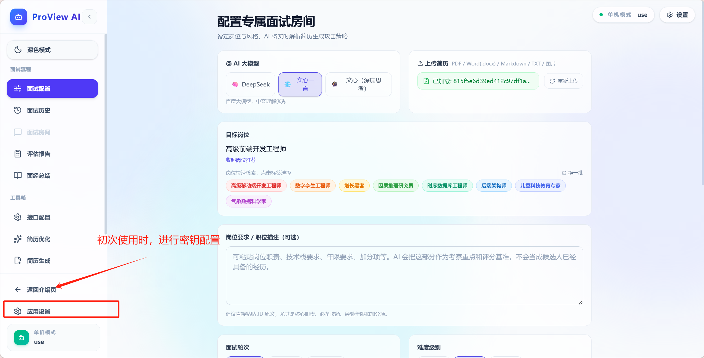


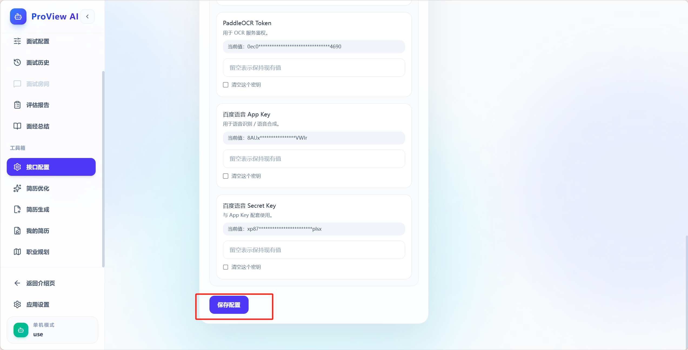

### 密钥配置指导

DeepSeek 的 API URL 和 Token 需要到官方平台购买。若你只是先体验项目能力，也可以优先使用百度提供的文心一言、 PaddleOCR 和语音服务接口，每日免费额度通常足够完成多次面试练习。

#### 文心一言大模型 API 获取方式

登录 [百度星河社区](https://aistudio.baidu.com/overview) 并完成实名认证：


复制对应密钥后填入系统即可。

#### PaddleOCR API 获取方式

登录 [百度星河社区](https://aistudio.baidu.com/overview) 并完成实名认证：

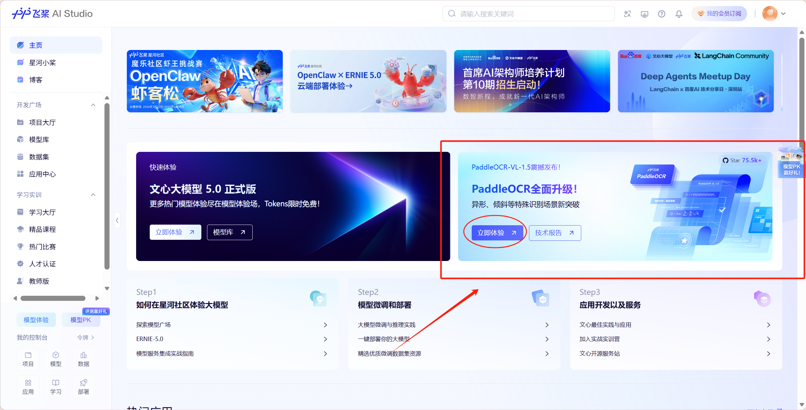

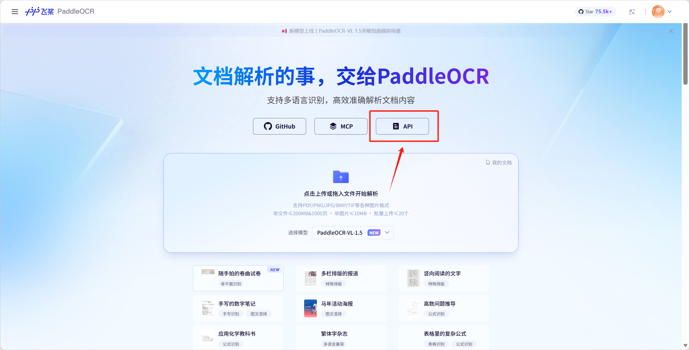

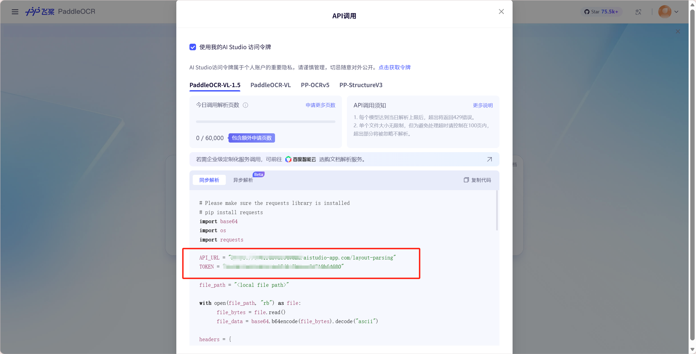

复制对应密钥后填入系统即可。

#### 百度语音 API 获取方式

完成登录和实名认证后，参考 [百度语音接入文档](https://cloud.baidu.com/doc/AI_REFERENCE/s/Im3zhy4w6) 完成配置：

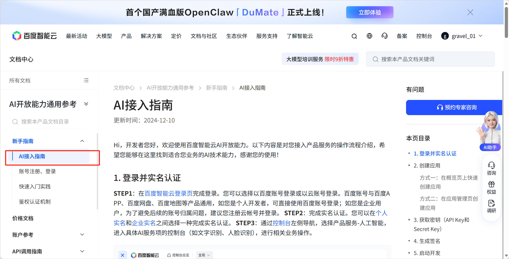

## 功能简介

### 面试配置

支持多种面试场景和多种音色配置：


开始面试后，会根据上传的简历格式调用 OCR 进行解析：

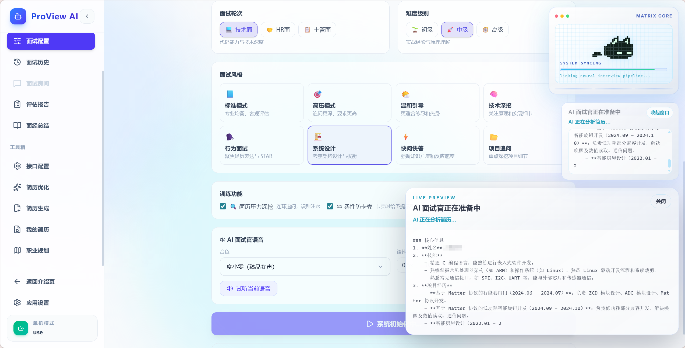

### 面试房间

支持语音实时交互面试，语音输入会同步转为文字并进行实时纠错：

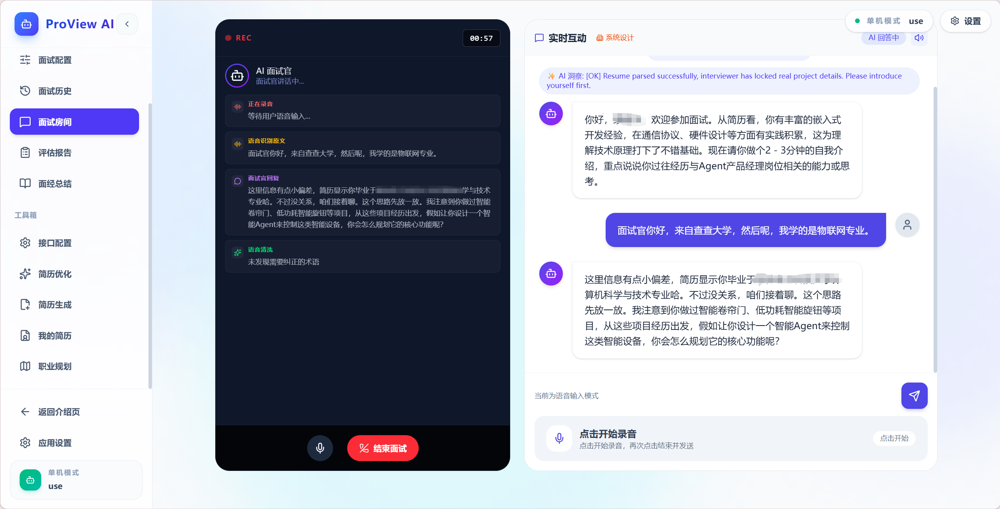

面试可灵活结束，方便随时练习：

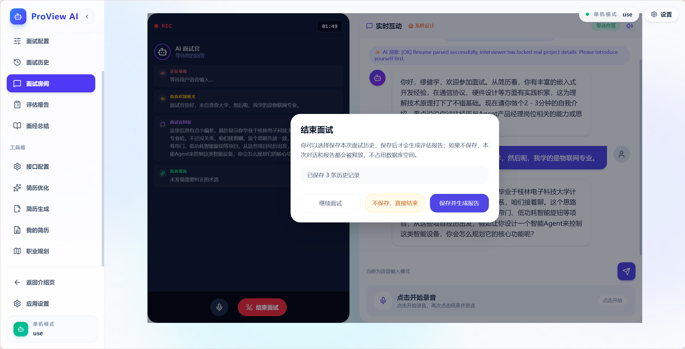

### 评估报告

面试结束后会自动生成评估报告，帮助用户直观查看不足：


### 简历优化

既支持直接优化，也支持按目标方向进行定制化优化：

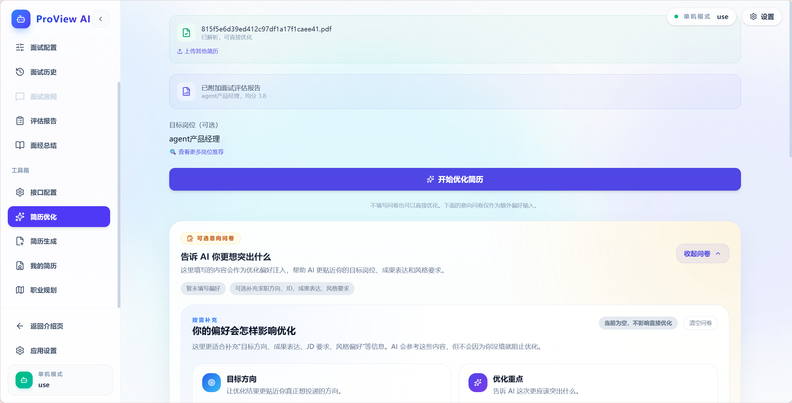

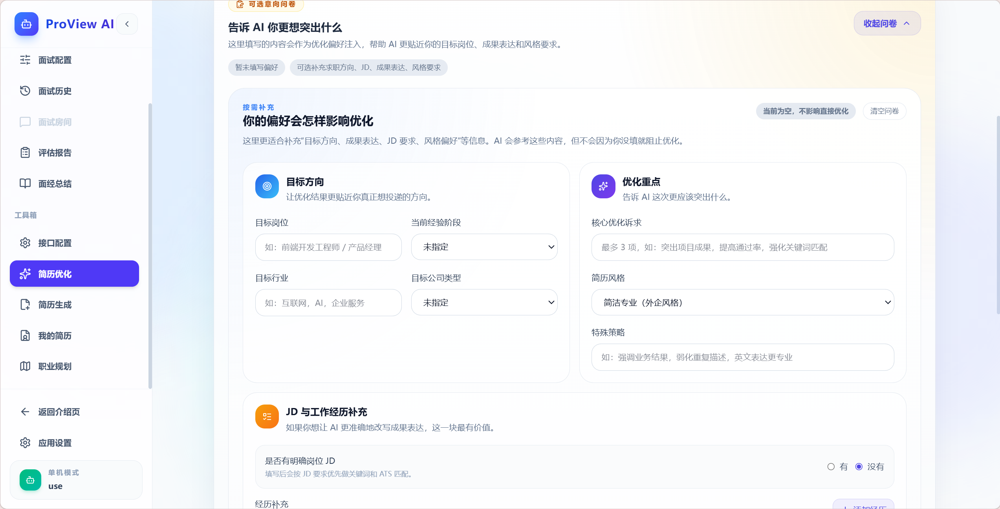

### 简历生成

内置多种简历模板，集简历生成、AI 优化和输出于一体：


### 我的简历

支持对上传的简历进行集中管理：

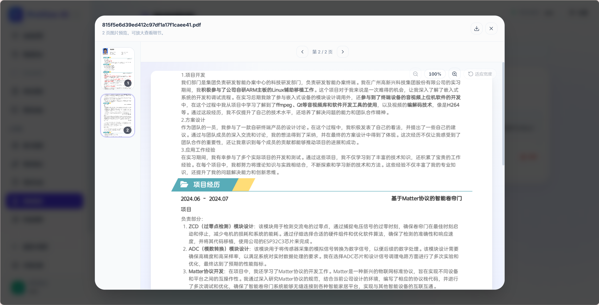

### 职业生涯规划指导（完善中）

支持生成可长期跟踪的职业规划建议：

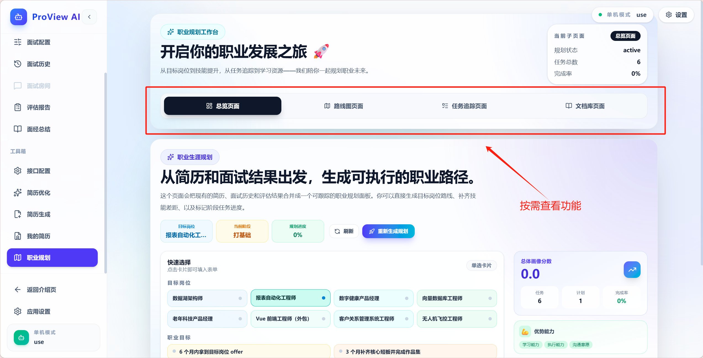
